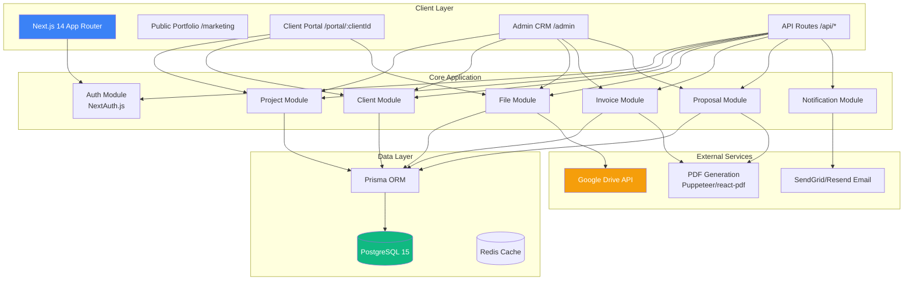
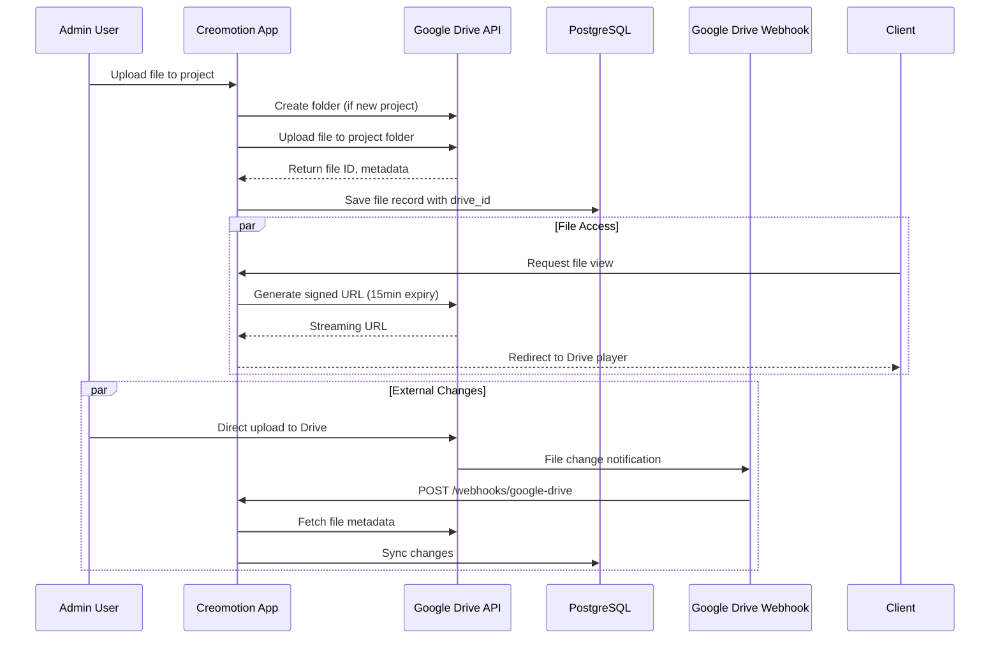
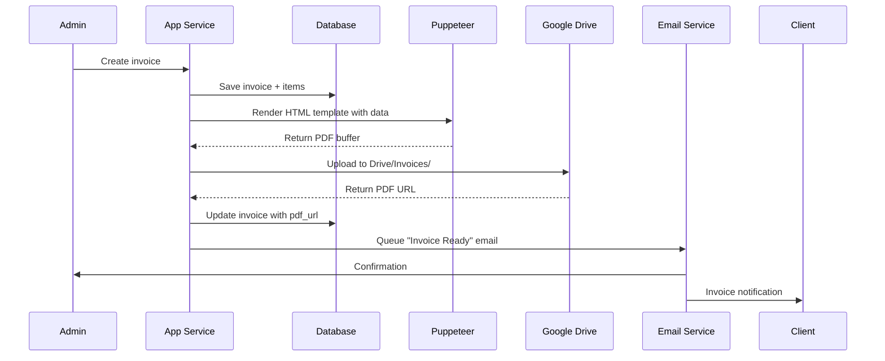

# 🏗️ Creomotion System Architecture

## Executive Summary

**Pattern:** Modular Monolith (Next.js 14 App Router)  
**Rationale:** Solo dev, 6-8 week MVP. Clean boundaries allow future extraction to microservices.  
**Deployment:** Docker Compose → Kubernetes (future)

---

## 1. System Architecture Diagram



### Architecture Decisions

| Decision | Choice | Rationale |
|----------|--------|-----------|
| **Pattern** | Modular Monolith | Solo dev, faster iteration, can split later |
| **Auth** | NextAuth.js + JWT | Supports multiple providers, session management |
| **API Style** | REST (tRPC optional) | Simple, well-understood, great tooling |
| **File Storage** | Google Drive API | 5TB provided, no storage costs |
| **PDF Gen** | Puppeteer (invoices) + react-pdf (proposals) | Puppeteer for pixel-perfect invoices, react-pdf for dynamic proposals |
| **Queues** | Inngest / BullMQ | Background jobs for emails, PDF generation |
| **Cache** | Redis | Sessions, rate limiting, hot data |

---

## 2. Database Schema (PostgreSQL)

### Core Entities ERD

```mermaid
erDiagram
    USER ||--o{ PROJECT : manages
    USER ||--o{ COMMENT : writes
    USER ||--o{ ACTIVITY : generates
    
    CLIENT ||--o{ PROJECT : owns
    CLIENT ||--o{ COMMENT : writes
    CLIENT ||--o{ FILE_ACCESS : has
    
    PROJECT ||--o{ PROJECT_PHASE : contains
    PROJECT ||--o{ FILE : has
    PROJECT ||--o{ COMMENT : has
    PROJECT ||--o{ INVOICE : billed_via
    PROJECT ||--o{ PROPOSAL : has
    PROJECT ||--o{ ACTIVITY : logs
    
    PROJECT_PHASE ||--o{ MILESTONE : contains
    
    FILE ||--o{ FILE_VERSION : versions
    FILE ||--o{ COMMENT : discusses
    FILE ||--o{ FILE_ACCESS : controls
    
    COMMENT ||--o{ COMMENT : replies_to
    
    INVOICE ||--o{ INVOICE_ITEM : contains
    
    PROPOSAL ||--o{ PROPOSAL_SECTION : contains
    
    USER {
        uuid id PK
        string email UK
        string name
        string role "ADMIN|EDITOR|VIEWER"
        string avatar_url
        timestamp created_at
        timestamp updated_at
    }
    
    CLIENT {
        uuid id PK
        string email UK
        string name
        string company
        enum type "TV_DIRECTOR|AGENCY_PRODUCER|STARTUP_FOUNDER"
        string portal_token
        timestamp portal_token_expires
        jsonb settings
        timestamp created_at
    }
    
    PROJECT {
        uuid id PK
        string title
        text description
        enum status "DRAFT|IN_PROGRESS|REVIEW|APPROVED|DELIVERED|ARCHIVED"
        uuid client_id FK
        uuid manager_id FK
        decimal budget
        date start_date
        date deadline
        jsonb metadata
        timestamp created_at
        timestamp updated_at
    }
    
    PROJECT_PHASE {
        uuid id PK
        uuid project_id FK
        string name
        int order_index
        enum status "PENDING|ACTIVE|COMPLETED"
        date start_date
        date end_date
    }
    
    MILESTONE {
        uuid id PK
        uuid phase_id FK
        string title
        text description
        date target_date
        enum status "PENDING|REACHED|MISSED"
    }
    
    FILE {
        uuid id PK
        uuid project_id FK
        string google_drive_id UK
        string name
        string mime_type
        bigint size_bytes
        enum category "RAW|EDIT|FINAL|REFERENCE|DELIVERABLE"
        enum approval_status "PENDING|IN_REVIEW|APPROVED|REJECTED"
        int version_number
        uuid uploaded_by_id FK
        timestamp uploaded_at
        jsonb metadata
    }
    
    FILE_VERSION {
        uuid id PK
        uuid file_id FK
        string google_drive_id
        int version_number
        text change_notes
        timestamp created_at
    }
    
    FILE_ACCESS {
        uuid id PK
        uuid file_id FK
        uuid client_id FK
        enum permission "VIEW|DOWNLOAD|COMMENT"
        timestamp granted_at
        timestamp expires_at
    }
    
    COMMENT {
        uuid id PK
        uuid project_id FK
        uuid file_id FK "nullable"
        uuid author_id FK
        enum author_type "USER|CLIENT"
        text content
        jsonb annotations "video timestamps, coordinates"
        uuid parent_id FK "nullable - for replies"
        timestamp created_at
    }
    
    MOODBOARD_ITEM {
        uuid id PK
        uuid project_id FK
        string image_url
        text description
        enum status "PENDING|APPROVED|REJECTED"
        timestamp created_at
    }
    
    INVOICE {
        uuid id PK
        string invoice_number UK
        uuid project_id FK
        uuid client_id FK
        enum status "DRAFT|SENT|PAID|OVERDUE|CANCELLED"
        decimal subtotal
        decimal tax_amount
        decimal total
        date issue_date
        date due_date
        date paid_date
        string pdf_url
        timestamp created_at
    }
    
    INVOICE_ITEM {
        uuid id PK
        uuid invoice_id FK
        string description
        decimal quantity
        decimal rate
        decimal amount
        int sort_order
    }
    
    PROPOSAL {
        uuid id PK
        string proposal_number UK
        uuid project_id FK
        uuid client_id FK
        enum status "DRAFT|SENT|VIEWED|ACCEPTED|REJECTED|EXPIRED"
        string title
        text scope
        decimal total_price
        int validity_days
        date valid_until
        string pdf_url
        timestamp created_at
        timestamp updated_at
    }
    
    PROPOSAL_SECTION {
        uuid id PK
        uuid proposal_id FK
        string title
        text content
        int sort_order
    }
    
    ACTIVITY {
        uuid id PK
        uuid project_id FK
        enum type "UPLOAD|COMMENT|APPROVAL|STATUS_CHANGE|INVOICE_SENT|PAYMENT"
        string description
        uuid actor_id FK
        enum actor_type "USER|CLIENT|SYSTEM"
        jsonb metadata
        timestamp created_at
    }
    
    NOTIFICATION {
        uuid id PK
        uuid recipient_id FK
        enum recipient_type "USER|CLIENT"
        enum channel "EMAIL|IN_APP"
        string subject
        text content
        enum status "PENDING|SENT|FAILED"
        timestamp sent_at
        timestamp read_at
    }
```



### Key Design Decisions

1. **Polymorphic Comments** - Single table for both user and client comments with `author_type` discriminator
2. **File Versioning** - Separate table to track Google Drive versions without losing history
3. **Activity Log** - Immutable audit trail for timeline/recent activity feeds
4. **Portal Tokens** - Time-limited magic links for client access (no passwords for clients)

---

## 3. Service Boundaries

### Module Structure (Next.js App Router)

```
app/
├── (marketing)/                    # Public portfolio
│   ├── layout.tsx
│   ├── page.tsx                    # Landing
│   ├── work/[slug]/page.tsx        # Case studies
│   └── contact/page.tsx
│
├── (portal)/                       # Client portal (authenticated)
│   ├── layout.tsx
│   ├── portal/
│   │   └── [token]/                # Magic link entry
│   │       ├── page.tsx            # Client dashboard
│   │       ├── timeline/page.tsx
│   │       ├── files/page.tsx
│   │       └── approve/page.tsx
│   └── api/portal/
│       └── auth/route.ts
│
├── (admin)/                        # CRM (admin authenticated)
│   ├── layout.tsx
│   ├── admin/
│   │   ├── dashboard/page.tsx
│   │   ├── projects/page.tsx
│   │   ├── clients/page.tsx
│   │   ├── files/page.tsx
│   │   ├── invoices/page.tsx
│   │   └── settings/page.tsx
│   └── api/admin/
│       ├── projects/route.ts
│       ├── clients/route.ts
│       ├── files/route.ts
│       ├── invoices/route.ts
│       └── proposals/route.ts
│
├── api/                            # Public/shared API routes
│   ├── webhooks/
│   │   ├── google-drive/route.ts   # Webhook handler
│   │   └── payments/route.ts       # Stripe/webhook
│   └── public/
│       └── portfolio/route.ts
│
lib/
├── modules/                        # Domain modules (service layer)
│   ├── auth/
│   ├── project/
│   ├── client/
│   ├── file/
│   │   ├── service.ts              # Google Drive integration
│   │   ├── upload.ts
│   │   └── permissions.ts
│   ├── invoice/
│   │   ├── service.ts
│   │   ├── pdf-generator.ts
│   │   └── templates/
│   ├── proposal/
│   └── notification/
│       ├── service.ts
│       ├── email.ts
│       └── templates/
│
├── db/
│   ├── schema.prisma
│   └── seed.ts
│
└── integrations/
    ├── google-drive/
    │   ├── client.ts
    │   ├── webhooks.ts
    │   └── folder-structure.ts
    └── email/
        ├── sendgrid.ts
        └── templates/
```

### Service Responsibilities

| Module | Responsibility | External Integration |
|--------|----------------|---------------------|
| **Auth** | Session management, portal token generation | NextAuth.js |
| **Project** | CRUD, phases, milestones, status workflows | - |
| **Client** | Client profiles, portal access, preferences | - |
| **File** | Upload orchestration, versioning, permissions | Google Drive API |
| **Invoice** | Generation, PDF, status tracking | PDF service, Email |
| **Proposal** | Creation, versioning, PDF export | PDF service, Email |
| **Notification** | Email triggers, in-app alerts | SendGrid/Resend |

---

## 4. Google Drive Integration Architecture

### Pattern: Service Account with Webhook Sync



### Folder Structure Convention

```
Creomotion Clients (Shared Drive)
├── Client-A-Company/
│   ├── Project-1-Website-Redesign/
│   │   ├── 01_PreProduction/
│   │   ├── 02_Production/
│   │   ├── 03_PostProduction/
│   │   └── 04_Deliverables/
│   └── Project-2-Commercial/
└── Client-B-Startup/
    └── Product-Launch-Video/
```

### Access Control Strategy

| Scenario | Implementation |
|----------|----------------|
| **Admin Upload** | Service account owns file, stored in shared drive |
| **Client View** | Signed URLs via Google Drive API (15-min expiry) |
| **Client Download** | Direct Drive download links with permissions |
| **Video Streaming** | Embedded Google Drive video player (no storage cost) |

---

## 5. Docker Compose Infrastructure

```yaml
# docker-compose.yml
version: '3.8'

services:
  # Application
  app:
    build:
      context: .
      dockerfile: Dockerfile
    ports:
      - "3000:3000"
    environment:
      - NODE_ENV=production
      - DATABASE_URL=postgresql://postgres:postgres@db:5432/creomotion
      - REDIS_URL=redis://redis:6379
      - NEXTAUTH_SECRET=${NEXTAUTH_SECRET}
      - NEXTAUTH_URL=${NEXTAUTH_URL}
      - GOOGLE_SERVICE_ACCOUNT_KEY=${GOOGLE_SERVICE_ACCOUNT_KEY}
      - SENDGRID_API_KEY=${SENDGRID_API_KEY}
    depends_on:
      - db
      - redis
    volumes:
      - ./:/app
      - /app/node_modules
      - /app/.next
    
  # Background Job Worker
  worker:
    build:
      context: .
      dockerfile: Dockerfile.worker
    environment:
      - NODE_ENV=production
      - DATABASE_URL=postgresql://postgres:postgres@db:5432/creomotion
      - REDIS_URL=redis://redis:6379
      - GOOGLE_SERVICE_ACCOUNT_KEY=${GOOGLE_SERVICE_ACCOUNT_KEY}
      - SENDGRID_API_KEY=${SENDGRID_API_KEY}
    depends_on:
      - db
      - redis
    command: node worker.js
    
  # Database
  db:
    image: postgres:15-alpine
    environment:
      - POSTGRES_USER=postgres
      - POSTGRES_PASSWORD=postgres
      - POSTGRES_DB=creomotion
    volumes:
      - postgres_data:/var/lib/postgresql/data
    ports:
      - "5432:5432"
    
  # Cache & Sessions
  redis:
    image: redis:7-alpine
    volumes:
      - redis_data:/data
    ports:
      - "6379:6379"
    
  # Reverse Proxy (Production)
  nginx:
    image: nginx:alpine
    ports:
      - "80:80"
      - "443:443"
    volumes:
      - ./nginx.conf:/etc/nginx/nginx.conf
      - ./ssl:/etc/nginx/ssl
    depends_on:
      - app

volumes:
  postgres_data:
  redis_data:
```

---

## 6. PDF Generation Architecture

### Dual Strategy

| Document | Tool | Reason |
|----------|------|--------|
| **Invoices** | Puppeteer + HTML template | Pixel-perfect, print-ready, strict layout |
| **Proposals** | react-pdf | Dynamic content, interactive preview, faster generation |

### Invoice Flow



### Storage Strategy

- Generated PDFs stored in Google Drive under `Invoices/` and `Proposals/` folders
- Database stores `pdf_url` for quick access
- Versioned filenames: `INV-2024-001-v1.pdf`

---

## 7. Notification & Email System

### Trigger Matrix

| Event | Recipients | Timing | Channel |
|-------|------------|--------|---------|
| File uploaded | Project client | Immediate | Email |
| Comment added | Thread participants | Immediate | Email + In-app |
| Status changed | Client | Immediate | Email |
| Invoice sent | Client + Admin | Immediate | Email |
| Milestone approaching | Client + Admin | 24h before | Email |
| Proposal viewed | Admin | Immediate | In-app |
| Approval requested | Client | Immediate | Email |

### Implementation

```typescript
// lib/notification/service.ts
interface NotificationJob {
  type: 'EMAIL' | 'IN_APP';
  template: string;
  recipients: Recipient[];
  data: Record<string, any>;
  priority: 'HIGH' | 'NORMAL' | 'LOW';
}

// Using Inngest for background processing
export async function queueNotification(job: NotificationJob) {
  await inngest.send({
    name: 'notification/send',
    data: job,
  });
}
```

---

## 8. Scalability & Security Considerations

### Scalability Path

| Phase | Scale | Architecture Change |
|-------|-------|---------------------|
| **MVP** | 1-10 projects/month | Single container, monolith |
| **Growth** | 50+ projects/month | Horizontal scaling, separate worker |
| **Scale** | 500+ projects/month | Extract File Service, CDN for previews |

### Security Checklist

- [ ] **Auth**: NextAuth.js with CSRF protection
- [ ] **Sessions**: Redis-backed, 24h expiry
- [ ] **Portal**: Time-limited magic tokens (7 days default)
- [ ] **Files**: Signed URLs only, no direct Drive access
- [ ] **API**: Rate limiting per IP + per user
- [ ] **DB**: Row-level security for multi-tenant data
- [ ] **Secrets**: Environment variables only, no commits
- [ ] **Webhhook**: Signature verification for Drive webhooks

### Performance Targets

| Metric | Target |
|--------|--------|
| Page load | < 2s (TTFB) |
| File upload | Progress indicator, async |
| PDF generation | < 5s for invoices |
| Video streaming | Direct Drive (no proxy overhead) |
| API response | < 200ms p95 |

---

## 9. API Contract Summary

### Authentication Endpoints

```
POST   /api/auth/signin            # Admin login
POST   /api/auth/signout
GET    /api/auth/session
POST   /api/portal/auth/:token     # Client magic link
```

### Core API Endpoints

```
# Projects
GET    /api/admin/projects
POST   /api/admin/projects
GET    /api/admin/projects/:id
PUT    /api/admin/projects/:id
DELETE /api/admin/projects/:id
PUT    /api/admin/projects/:id/status

# Clients
GET    /api/admin/clients
POST   /api/admin/clients
PUT    /api/admin/clients/:id/portal-access  # Generate magic link

# Files (Admin)
POST   /api/admin/projects/:id/files          # Initiate upload
GET    /api/admin/files/:id/signed-url        # Get upload URL
POST   /api/admin/files/:id/complete          # Confirm upload

# Files (Client Portal)
GET    /api/portal/files                      # List accessible files
GET    /api/portal/files/:id/view             # Get streaming URL
POST   /api/portal/files/:id/comments

# Invoices
POST   /api/admin/invoices                    # Create draft
POST   /api/admin/invoices/:id/generate       # Generate PDF
POST   /api/admin/invoices/:id/send           # Email to client
PUT    /api/admin/invoices/:id/status

# Proposals
POST   /api/admin/proposals
PUT    /api/admin/proposals/:id
POST   /api/admin/proposals/:id/generate
POST   /api/admin/proposals/:id/send

# Webhooks
POST   /api/webhooks/google-drive             # Drive change events
```

---

## 10. Development Phases

### Phase 1: Foundation (Week 1-2)
- [ ] Docker setup + PostgreSQL schema
- [ ] NextAuth.js authentication
- [ ] Project CRUD + Client management
- [ ] Basic Google Drive folder creation

### Phase 2: Client Portal (Week 3-4)
- [ ] Magic link authentication
- [ ] Portal dashboard + timeline
- [ ] File upload/view integration
- [ ] Comment system

### Phase 3: Business Logic (Week 5-6)
- [ ] Invoice system + PDF generation
- [ ] Proposal builder + PDF export
- [ ] Approval workflows
- [ ] Activity logging

### Phase 4: Polish & Launch (Week 7-8)
- [ ] Email notifications
- [ ] Public portfolio pages
- [ ] Testing + bug fixes
- [ ] Production deployment

---

*Architecture by 🏗️ System Architect | Nexus Agent Team*
